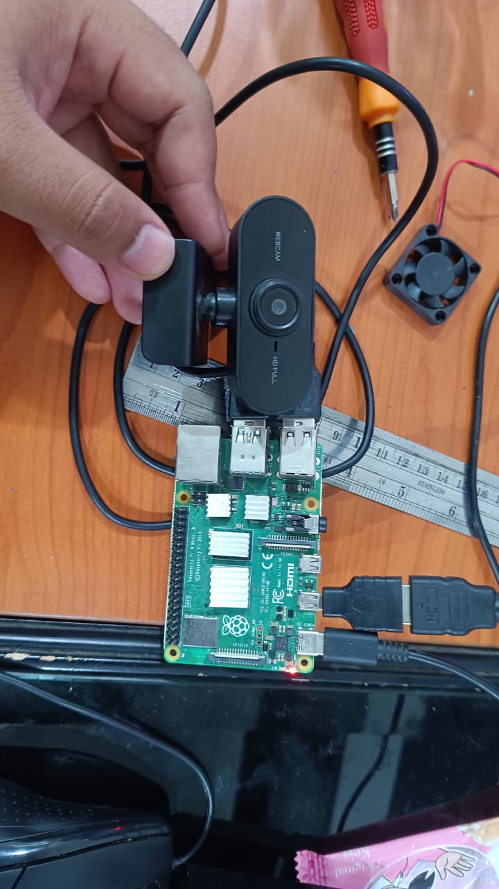

# Sign Language Detection for Raspberry Pi

This project provides MediaPipe-based hand gesture collection and recognition for:

- `single hand`
- `two hand`

## Component List

Main components required:

- Raspberry Pi
- camera / webcam
- Python 3.11
- MediaPipe Hand Landmarker model (`hand_landmarker.task`)
- monitor or remote desktop access to view the collector and recognizer

Component diagram:



Main features:

- finger joint angle extraction
- palm orientation extraction
- separate support for single-hand and two-hand gestures
- separate dataset files so single-hand and two-hand data do not get mixed

## File Structure

- [collector_SINGLE_HAND.py](collector_SINGLE_HAND.py): records single-hand gestures into `gestures.json`
- [recog_single_hand.py](recog_single_hand.py): single-hand recognizer
- [collector_TWO_HAND.py](collector_TWO_HAND.py): records two-hand gestures into `gestures_two_hand.json`
- [recog_two_hand.py](recog_two_hand.py): two-hand recognizer
- [gestures.json](gestures.json): single-hand gesture dataset
- [gestures_two_hand.json](gestures_two_hand.json): two-hand gesture dataset
- `hand_landmarker.task`: MediaPipe Hand Landmarker model
- [requirements.txt](requirements.txt): Python dependencies

## Quick Setup on PC / Laptop

Create a virtual environment and install dependencies:

```bash
python -m venv venv
venv\Scripts\activate
pip install --upgrade pip setuptools wheel
pip install -r requirements.txt
```

Download the `hand_landmarker.task` model and place it in the project folder:

```bash
curl -L -o hand_landmarker.task https://storage.googleapis.com/mediapipe-models/hand_landmarker/hand_landmarker/float16/1/hand_landmarker.task
```

## How to Run

### Single Hand

Collector:

```bash
python .\collector_SINGLE_HAND.py
```

How to use the single-hand Sign Collector:

1. run `collector_SINGLE_HAND.py`
2. make sure one hand is clearly detected by the camera
3. form the gesture you want to save
4. press `S` to capture the current pose
5. type the gesture name
6. press `Enter` to save it
7. press `Esc` to cancel
8. press `Q` to quit

Notes:

- saved data goes to `gestures.json`
- the collector stores both finger angles and palm orientation
- keep the gesture stable when pressing `S`

Recognizer:

```bash
python .\recog_single_hand.py
```

### Two Hand

Collector:

```bash
python .\collector_TWO_HAND.py
```

How to use the two-hand Sign Collector:

1. run `collector_TWO_HAND.py`
2. make sure both hands are fully detected
3. form the two-hand gesture you want to save
4. press `S` to capture the current pose
5. type the gesture name
6. press `Enter` to save it
7. press `Esc` to cancel
8. press `Q` to quit

Notes:

- saved data goes to `gestures_two_hand.json`
- the collector only saves data when both left and right hands are detected
- besides hand shape, the system also stores the relative position between both hands

Recognizer:

```bash
python .\recog_two_hand.py
```

## Gesture Storage Files

Single-hand and two-hand modes are stored separately:

- single-hand -> `gestures.json`
- two-hand -> `gestures_two_hand.json`

This is important so training data and recognizer logic stay separate.

## Usage Notes

- for single-hand mode, the system reads finger shape and palm orientation
- for two-hand mode, the system reads:
  - left hand shape
  - right hand shape
  - orientation of each hand
  - positional relation between both hands
- if a JSON file is empty or missing, the program automatically uses empty data
- if the webcam cannot be opened, the program prints a clearer error message

## Raspberry Pi Setup

This section is intentionally kept because Python 3.11 setup is essential for Raspberry Pi.

## 1. Install build dependencies

```bash
sudo apt update
sudo apt install -y \
build-essential wget curl git \
libssl-dev zlib1g-dev libbz2-dev libreadline-dev \
libsqlite3-dev libffi-dev libncursesw5-dev xz-utils \
tk-dev libxml2-dev libxmlsec1-dev liblzma-dev \
libgdbm-dev libnss3-dev uuid-dev
```

## 2. Download Python 3.11 source

```bash
cd /usr/src
sudo wget https://www.python.org/ftp/python/3.11.10/Python-3.11.10.tgz
sudo tar xzf Python-3.11.10.tgz
cd Python-3.11.10
```

## 3. Build and install Python 3.11

```bash
sudo ./configure --enable-optimizations
sudo make -j4
sudo make altinstall
```

## 4. Verify installation

```bash
python3.11 --version
```

## 5. Create a virtual environment

```bash
python3.11 -m venv ~/myenv
source ~/myenv/bin/activate
```

## 6. Upgrade pip

```bash
pip install --upgrade pip setuptools wheel
```

## 7. Install core libraries

### NumPy

```bash
pip install numpy
```

### OpenCV

Try installing from pip first:

```bash
pip install opencv-python
```

If that fails:

```bash
sudo apt install python3-opencv
```

## 8. Install MediaPipe

Try first:

```bash
pip install mediapipe
```

If it fails on Raspberry Pi:

```bash
pip install mediapipe-rpi4
```

## Recommended Workflow

1. record gestures with the collector
2. check the saved JSON file
3. run the recognizer
4. if recognition is still unstable, re-record the gesture with a more consistent hand pose

## Program Preview

### Sign Collector


### Sign Recognizer


